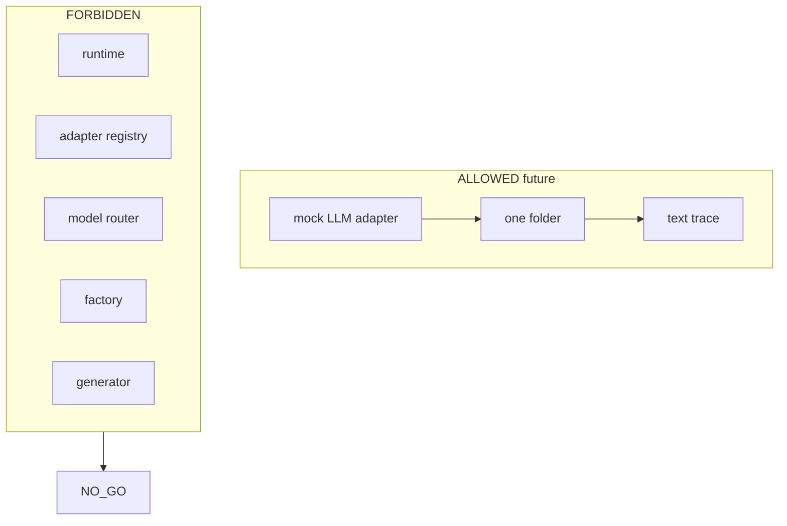

# No Runtime Boundary — Phase 3.2

```mermaid
flowchart TB
  subgraph allowed [ALLOWED future]
    MOCK[mock LLM adapter]
    ONE[one folder]
    TRACE[text trace]
  end

  subgraph forbidden [FORBIDDEN]
    RT[runtime]
    REG[adapter registry]
    ROUTER[model router]
    FAC[factory]
    GEN[generator]
  end

  MOCK --> ONE --> TRACE
  forbidden --> STOP[NO_GO]
```

Reference: [NO_RUNTIME_NO_FACTORY_POLICY.md](../NO_RUNTIME_NO_FACTORY_POLICY.md)
