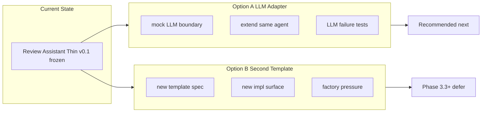

# Option Comparison Diagram

```mermaid
flowchart LR
  subgraph now [Current State]
    THIN[Review Assistant Thin v0.1 frozen]
  end

  subgraph optA [Option A LLM Adapter]
    A1[mock LLM boundary]
    A2[extend same agent]
    A3[LLM failure tests]
  end

  subgraph optB [Option B Second Template]
    B1[new template spec]
    B2[new impl surface]
    B3[factory pressure]
  end

  THIN --> optA
  THIN --> optB
  optA --> WIN[Recommended next]
  optB --> LATER[Phase 3.3+ defer]
```

Reference: [OPTION_COMPARISON_MATRIX.md](../OPTION_COMPARISON_MATRIX.md)
