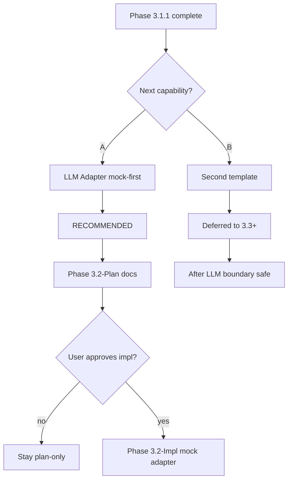

# Phase 3.2 Decision Diagram

```mermaid
flowchart TD
  START[Phase 3.1.1 complete] --> Q{Next capability?}
  Q -->|A| LLM[LLM Adapter mock-first]
  Q -->|B| T2[Second template]
  LLM --> REC[RECOMMENDED]
  T2 --> DEFER[Deferred to 3.3+]
  REC --> PLAN[Phase 3.2-Plan docs]
  PLAN --> GATE{User approves impl?}
  GATE -->|no| STOP[Stay plan-only]
  GATE -->|yes| IMPL[Phase 3.2-Impl mock adapter]
  DEFER --> LATER[After LLM boundary safe]
```

**Current node:** Phase 3.2-Plan complete → STOP until user impl prompt.

Reference: [PHASE_3_2_NEXT_CAPABILITY_DECISION.md](../PHASE_3_2_NEXT_CAPABILITY_DECISION.md)
