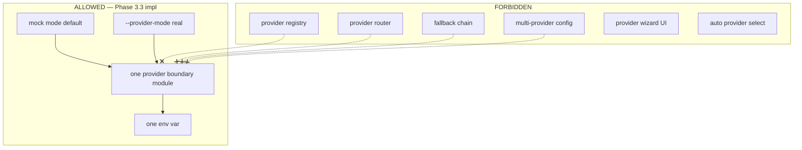

# No Provider Framework Boundary

```mermaid
flowchart TB
  subgraph Allowed["ALLOWED — Phase 3.3 impl"]
    Mock[mock mode default]
    Flag["--provider-mode real"]
    One[one provider boundary module]
    Env[one env var]
  end

  subgraph Forbidden["FORBIDDEN"]
    Reg[provider registry]
    Router[provider router]
    Fallback[fallback chain]
    Multi[multi-provider config]
    UI[provider wizard UI]
    Auto[auto provider select]
  end

  Mock --> One
  Flag --> One
  One --> Env

  Reg -.-x One
  Router -.-x One
  Fallback -.-x One
  Multi -.-x One
```

Second provider requires new governance phase — not a registry entry.
