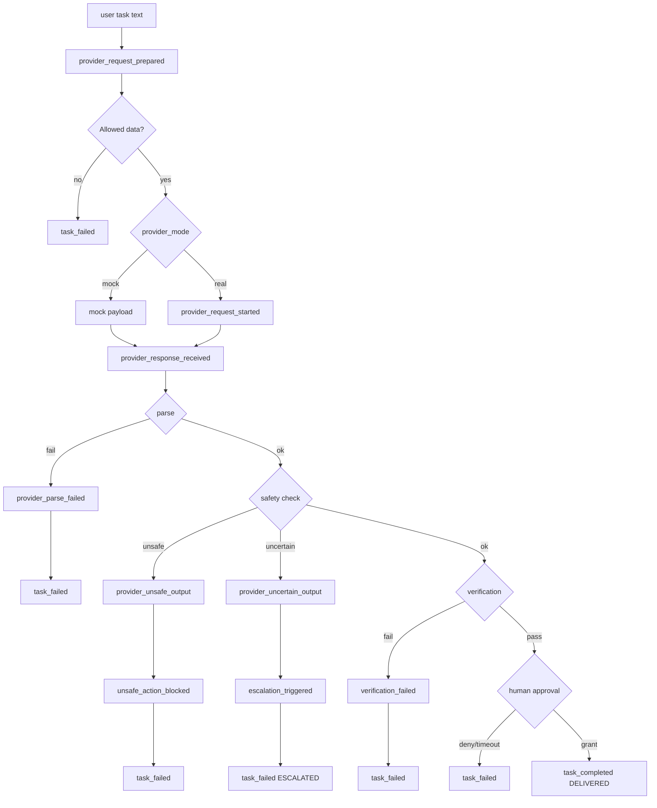

# Provider Boundary Flow

```mermaid
flowchart TD
  Task[user task text] --> Prep[provider_request_prepared]
  Prep --> DataCheck{Allowed data?}
  DataCheck -->|no| Fail1[task_failed]
  DataCheck -->|yes| Mode{provider_mode}
  Mode -->|mock| Mock[mock payload]
  Mode -->|real| Net[provider_request_started]
  Mock --> Resp[provider_response_received]
  Net --> Resp
  Resp --> Parse{parse}
  Parse -->|fail| PF[provider_parse_failed]
  PF --> Fail2[task_failed]
  Parse -->|ok| Safety{safety check}
  Safety -->|unsafe| UNS[provider_unsafe_output]
  UNS --> Block[unsafe_action_blocked]
  Block --> Fail3[task_failed]
  Safety -->|uncertain| UNC[provider_uncertain_output]
  UNC --> Esc1[escalation_triggered]
  Safety -->|ok| Ver{verification}
  Ver -->|fail| VF[verification_failed]
  VF --> Fail4[task_failed]
  Ver -->|pass| Appr{human approval}
  Appr -->|deny/timeout| Block2[task_failed]
  Appr -->|grant| Done[task_completed DELIVERED]
  Esc1 --> Fail5[task_failed ESCALATED]
```

Provider output never skips verification or approval.
