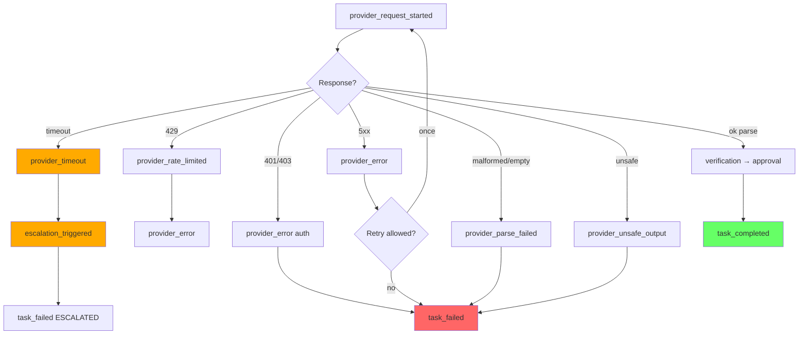

# Provider Error Flow

```mermaid
flowchart TD
  Start[provider_request_started] --> Call{Response?}
  Call -->|timeout| T[provider_timeout]
  T --> Esc[escalation_triggered]
  Esc --> EndE[task_failed ESCALATED]
  Call -->|429| RL[provider_rate_limited]
  RL --> Err[provider_error]
  Call -->|401/403| Auth[provider_error auth]
  Auth --> Fail[task_failed]
  Call -->|5xx| Srv[provider_error]
  Srv --> Retry{Retry allowed?}
  Retry -->|no| Fail
  Retry -->|once| Start
  Call -->|malformed/empty| Parse[provider_parse_failed]
  Parse --> Fail
  Call -->|unsafe| Unsafe[provider_unsafe_output]
  Unsafe --> Fail
  Call -->|ok parse| Chain[verification → approval]
  Chain --> Success[task_completed]

  style T fill:#fa0
  style Esc fill:#fa0
  style Fail fill:#f66
  style Success fill:#6f6
```

No hallucinated fallback draft on any error path.
