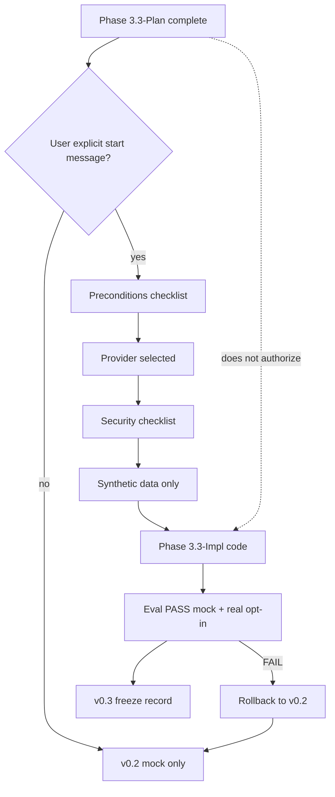

# Real Provider Governance Gate

```mermaid
flowchart TD
  Plan[Phase 3.3-Plan complete] --> User{User explicit start message?}
  User -->|no| Stay[v0.2 mock only]
  User -->|yes| Pre[Preconditions checklist]
  Pre --> Sel[Provider selected]
  Sel --> Sec[Security checklist]
  Sec --> Data[Synthetic data only]
  Data --> Impl[Phase 3.3-Impl code]
  Impl --> Eval[Eval PASS mock + real opt-in]
  Eval --> Freeze[v0.3 freeze record]
  Eval -->|FAIL| Roll[Rollback to v0.2]
  Roll --> Stay

  Plan -.->|does not authorize| Impl
```

Planning complete ≠ implementation authorized.
