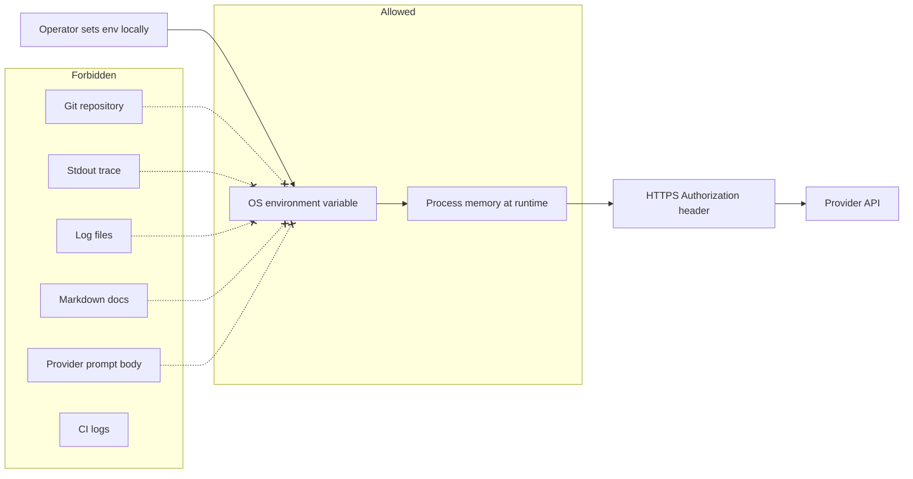

# Secret Handling Boundary

```mermaid
flowchart LR
  subgraph Allowed["Allowed"]
    Env[OS environment variable]
    Process[Process memory at runtime]
  end

  subgraph Forbidden["Forbidden"]
    Repo[Git repository]
    Trace[Stdout trace]
    Logs[Log files]
    MD[Markdown docs]
    Prompt[Provider prompt body]
    CI[CI logs]
  end

  User[Operator sets env locally] --> Env
  Env --> Process
  Process --> HTTP[HTTPS Authorization header]
  HTTP --> Provider[Provider API]

  Repo -.-x Env
  Trace -.-x Env
  Logs -.-x Env
  MD -.-x Env
  Prompt -.-x Env
```

Redact all error paths. Never log headers.
