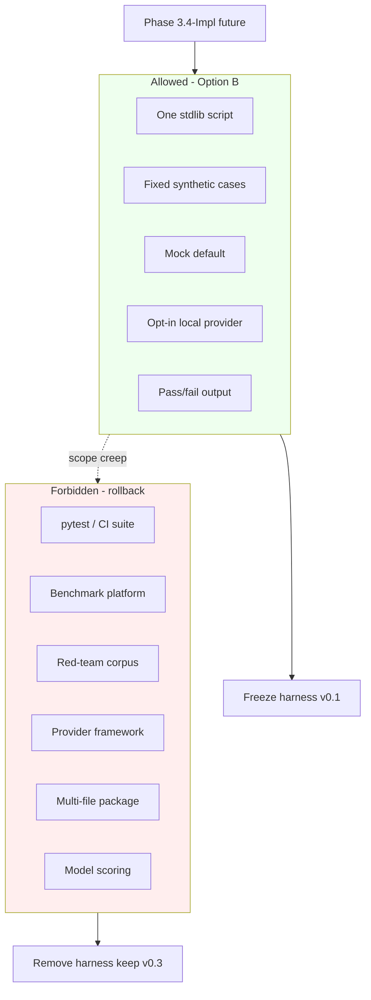

# Harness Scope Boundary

**Phase 3.4-Plan** — allowed future harness vs forbidden expansion.

## Documents

- [../RECOMMENDED_HARNESS_SCOPE.md](../RECOMMENDED_HARNESS_SCOPE.md)
- [../HARNESS_ARCHITECTURE_OPTIONS.md](../HARNESS_ARCHITECTURE_OPTIONS.md)
- [../ROLLBACK_AND_FREEZE_PLAN.md](../ROLLBACK_AND_FREEZE_PLAN.md)
