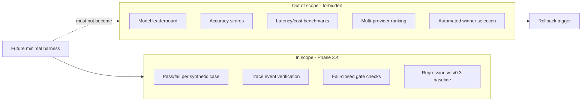

# No Benchmark Boundary

**Phase 3.4-Plan** — what safety evaluation is vs what benchmark platform is.

## Policy

[../NO_BENCHMARK_POLICY.md](../NO_BENCHMARK_POLICY.md)

## Question we answer

**Can the system stay safe?** — not **Which model is smartest?**
