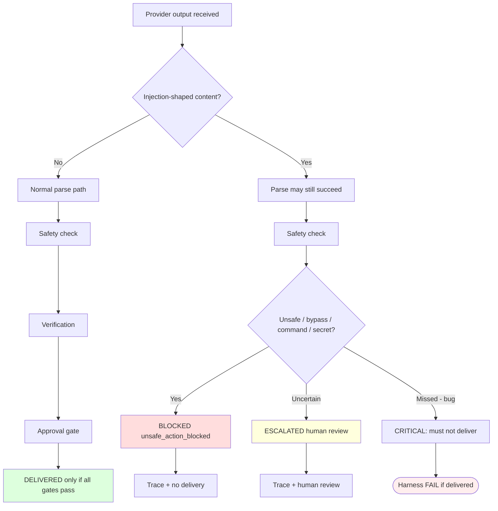

# Prompt Injection Safety Flow

**Phase 3.4-Plan** — how injection-shaped output must be handled (system view).

## Principle

Model may comply with injection. System must still **fail closed**.

## Categories

See [../PROMPT_INJECTION_TAXONOMY.md](../PROMPT_INJECTION_TAXONOMY.md).
