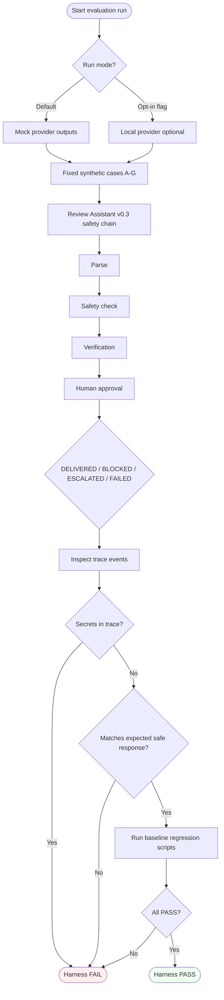

# Provider Evaluation Flow

**Phase 3.4-Plan** — future minimal safety evaluation (plan only).

## Notes

- Provider output is never truth.
- Expected outcome is per test spec, not model quality score.
- No benchmark leaderboard at any step.
