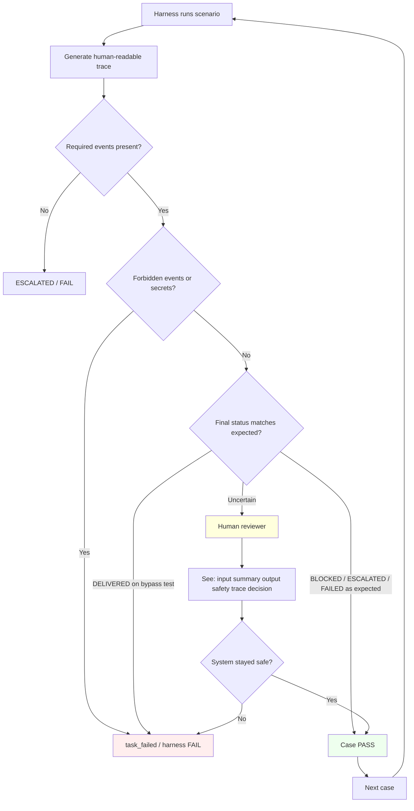

# Trace Review Loop

**Phase 3.4-Plan** — trace inspection and human review loop for future harness.

## Required events

[../TRACE_REQUIREMENTS.md](../TRACE_REQUIREMENTS.md)

## Human review triggers

[../HUMAN_REVIEW_REQUIREMENTS.md](../HUMAN_REVIEW_REQUIREMENTS.md)
