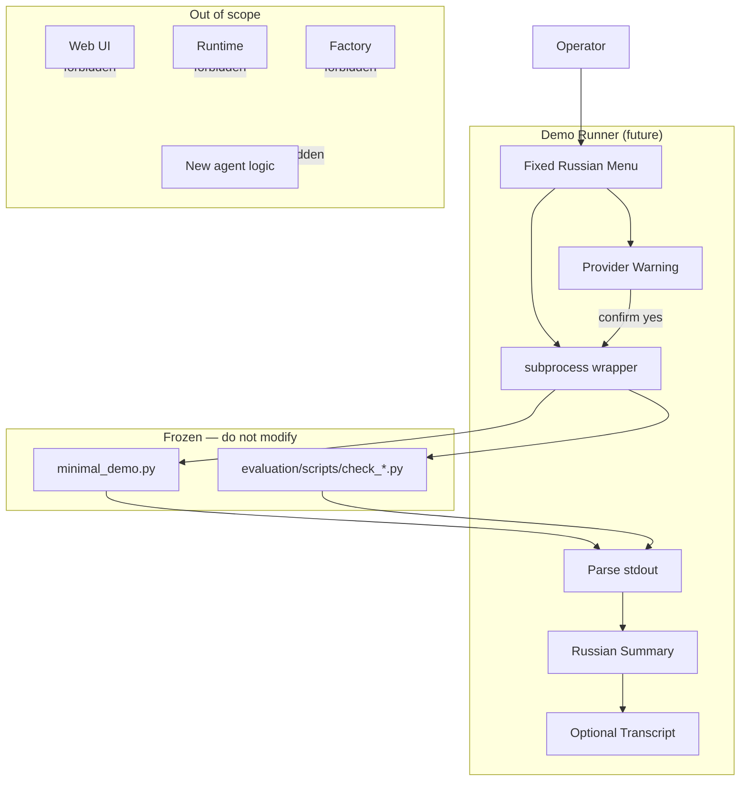

# Diagram — Demo Runner Boundary

**Phase 3.5.2-Plan**

## Legend

| Box | Meaning |
|-----|---------|
| Demo Runner | One stdlib script — wrapper only |
| Frozen | Existing behavior unchanged |
| Out of scope | Not in Phase 3.5.2 |
