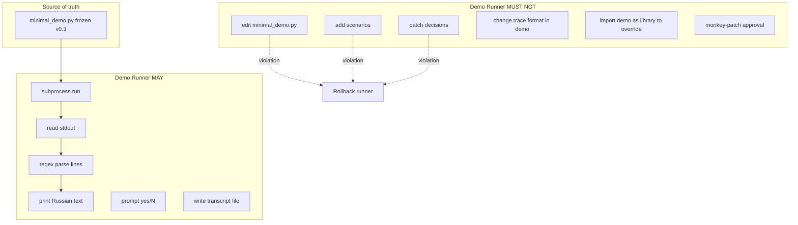
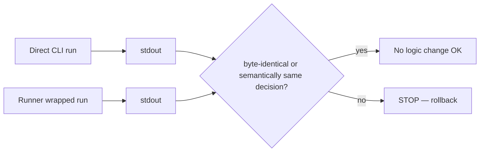

# Diagram — No Logic Change Boundary

**Phase 3.5.2-Plan**

```mermaid
flowchart TB
  subgraph ALLOWED["Demo Runner MAY"]
    A1[subprocess.run]
    A2[read stdout]
    A3[regex parse lines]
    A4[print Russian text]
    A5[prompt yes/N]
    A6[write transcript file]
  end

  subgraph FORBIDDEN["Demo Runner MUST NOT"]
    F1[edit minimal_demo.py]
    F2[add scenarios]
    F3[patch decisions]
    F4[change trace format in demo]
    F5[import demo as library to override]
    F6[monkey-patch approval]
  end

  subgraph SOURCE_OF_TRUTH["Source of truth"]
    DEMO[minimal_demo.py frozen v0.3]
  end

  DEMO --> A1
  A1 --> A2 --> A3 --> A4

  F1 -.->|violation| ROLLBACK[Rollback runner]
  F2 -.->|violation| ROLLBACK
  F3 -.->|violation| ROLLBACK
```

## Verification arrow

```mermaid
flowchart LR
  DIRECT[Direct CLI run] --> OUT1[stdout]
  RUNNER[Runner wrapped run] --> OUT2[stdout]
  OUT1 --> CMP{byte-identical or semantically same decision?}
  OUT2 --> CMP
  CMP -->|yes| PASS[No logic change OK]
  CMP -->|no| FAIL[STOP — rollback]
```

Policy: [NO_AGENT_LOGIC_CHANGE_POLICY.md](../NO_AGENT_LOGIC_CHANGE_POLICY.md)
