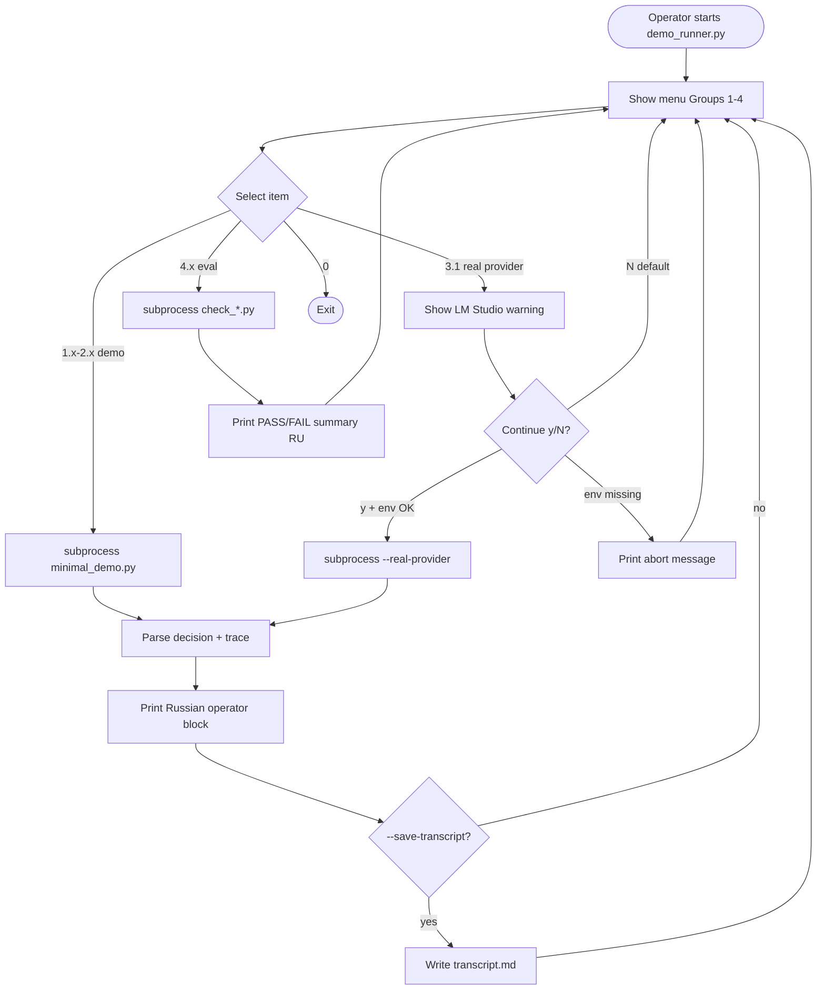

# Diagram — Operator Flow

**Phase 3.5.2-Plan**

## Notes

- Default path is no-network (groups 1, 2, 4).
- Group 3 never runs without explicit confirmation.
- Loop returns to menu until operator exits.
