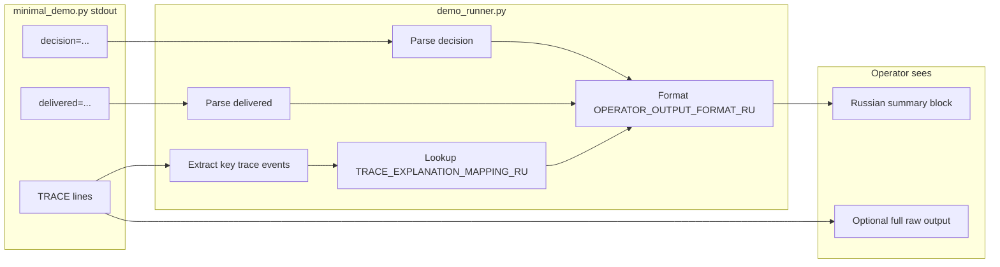
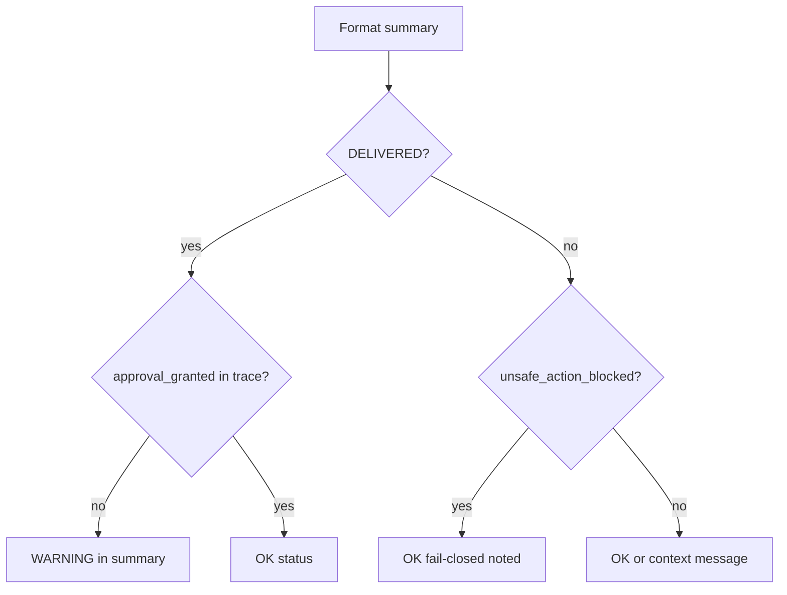

# Diagram — Trace to Summary Flow

**Phase 3.5.2-Plan**

## Safety checks in summary step

## Principle

Parse does **not** reinterpret agent decisions — only **explains** what demo already decided.
