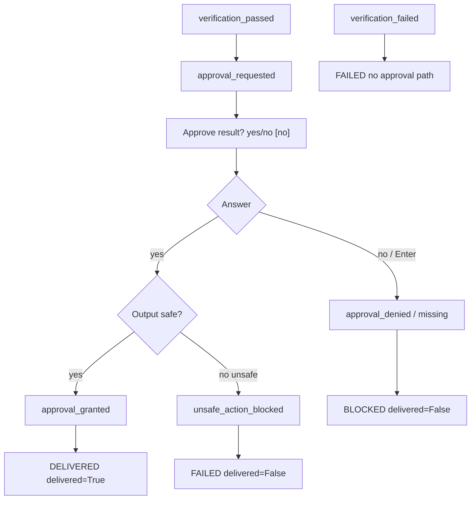

# Diagram — Approval Flow

**Phase 3.5.3-Plan**

## Rules

| State | Delivery |
|-------|----------|
| approval_granted + safe | allowed |
| approval denied / default no | BLOCKED |
| verification_failed | FAILED — no approval |
| unsafe output | FAILED — approval cannot override |

See [APPROVAL_MODEL_PLAN.md](../APPROVAL_MODEL_PLAN.md).
