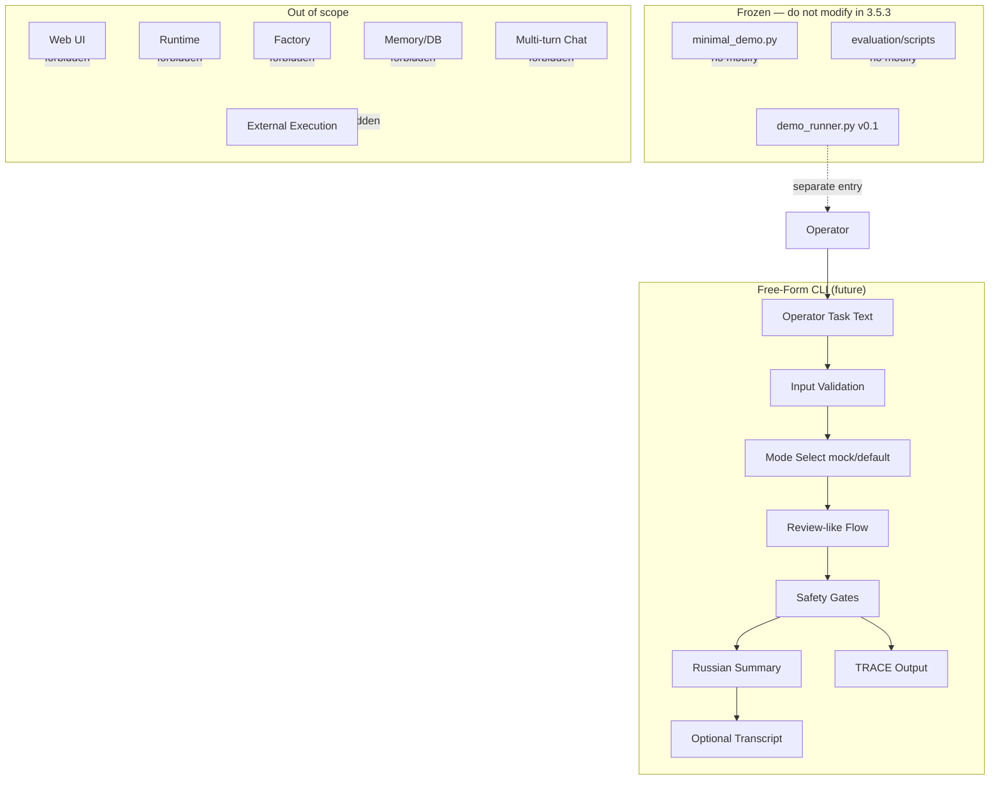

# Diagram — Free-Form CLI Boundary

**Phase 3.5.3-Plan**

## Legend

| Box | Meaning |
|-----|---------|
| Free-Form CLI | Future `free_form_cli.py` — controlled input mode |
| Frozen | Unchanged in this track |
| Out of scope | Not Phase 3.5.3 |
