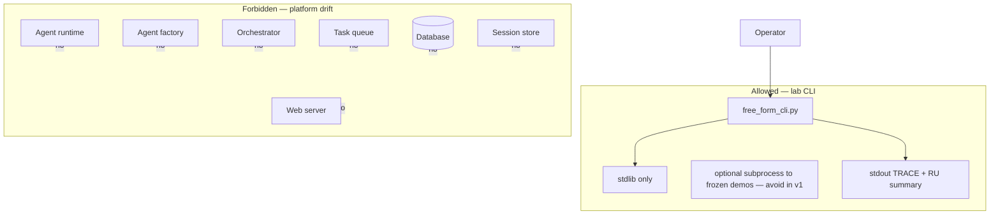

# Diagram — No Runtime Boundary

**Phase 3.5.3-Plan**

```mermaid
flowchart TB
  subgraph ALLOWED["Allowed — lab CLI"]
    FF[free_form_cli.py]
    STD[stdlib only]
    SUB[optional subprocess to frozen demos — avoid in v1]
    STDOUT[stdout TRACE + RU summary]
  end

  subgraph FORBIDDEN["Forbidden — platform drift"]
    RT[Agent runtime]
    FAC[Agent factory]
    ORCH[Orchestrator]
    QUEUE[Task queue]
    DB[(Database)]
    SESS[Session store]
    WEB[Web server]
  end

  OP[Operator] --> FF
  FF --> STD
  FF --> STDOUT

  RT -.->|no| FORBIDDEN
  FAC -.->|no| FORBIDDEN
  ORCH -.->|no| FORBIDDEN
  QUEUE -.->|no| FORBIDDEN
  DB -.->|no| FORBIDDEN
  SESS -.->|no| FORBIDDEN
  WEB -.->|no| FORBIDDEN
```

## Principle

Free-form CLI is a **one-shot terminal demo**, not a platform layer.

Same boundary as Demo Runner v0.1 and Phase 3.5.2 plan.
