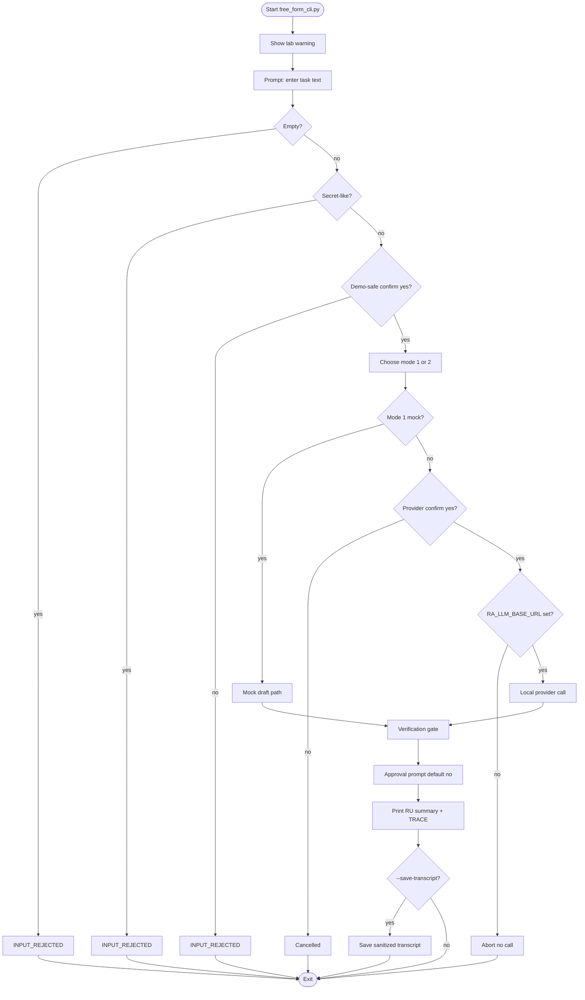

# Diagram — Operator Input Flow

**Phase 3.5.3-Plan**

```mermaid
flowchart TD
  START([Start free_form_cli.py]) --> WARN[Show lab warning]
  WARN --> TASK[Prompt: enter task text]
  TASK --> EMPTY{Empty?}
  EMPTY -->|yes| REJ1[INPUT_REJECTED]
  EMPTY -->|no| SECRET{Secret-like?}
  SECRET -->|yes| REJ2[INPUT_REJECTED]
  SECRET -->|no| SAFE{Demo-safe confirm yes?}
  SAFE -->|no| REJ3[INPUT_REJECTED]
  SAFE -->|yes| MODE[Choose mode 1 or 2]
  MODE --> M1{Mode 1 mock?}
  M1 -->|yes| MOCK[Mock draft path]
  M1 -->|no| CONF{Provider confirm yes?}
  CONF -->|no| CANCEL[Cancelled]
  CONF -->|yes| ENV{RA_LLM_BASE_URL set?}
  ENV -->|no| ABORT[Abort no call]
  ENV -->|yes| PROV[Local provider call]
  MOCK --> VERIFY[Verification gate]
  PROV --> VERIFY
  VERIFY --> APPR[Approval prompt default no]
  APPR --> OUT[Print RU summary + TRACE]
  OUT --> TX{--save-transcript?}
  TX -->|yes| SAVE[Save sanitized transcript]
  TX -->|no| END([Exit])
  SAVE --> END
  REJ1 --> END
  REJ2 --> END
  REJ3 --> END
  CANCEL --> END
  ABORT --> END
```

## Notes

- Single task per run
- No chat loop back to TASK
- Default mode: mock (Mode 1)
