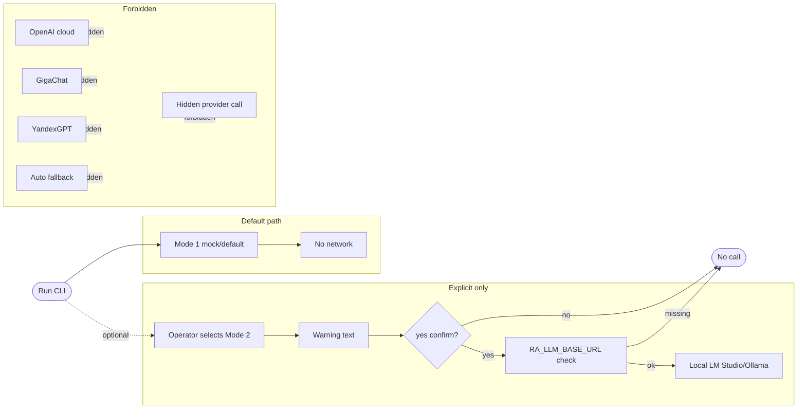

# Diagram — Provider Mode Boundary

**Phase 3.5.3-Plan**

```mermaid
flowchart LR
  subgraph DEFAULT["Default path"]
    M1[Mode 1 mock/default]
    NN[No network]
  end

  subgraph EXPLICIT["Explicit only"]
    SEL[Operator selects Mode 2]
    WARN[Warning text]
    YES{yes confirm?}
    ENV[RA_LLM_BASE_URL check]
    LOCAL[Local LM Studio/Ollama]
  end

  subgraph FORBIDDEN["Forbidden"]
    CLOUD[OpenAI cloud]
    GIGA[GigaChat]
    YANDEX[YandexGPT]
    AUTO[Auto fallback]
    HIDDEN[Hidden provider call]
  end

  START([Run CLI]) --> M1
  M1 --> NN
  START -.->|optional| SEL
  SEL --> WARN --> YES
  YES -->|no| STOP([No call])
  YES -->|yes| ENV
  ENV -->|missing| STOP
  ENV -->|ok| LOCAL

  CLOUD -.->|forbidden| FORBIDDEN
  GIGA -.->|forbidden| FORBIDDEN
  YANDEX -.->|forbidden| FORBIDDEN
  AUTO -.->|forbidden| FORBIDDEN
  HIDDEN -.->|forbidden| FORBIDDEN
```

See [PROVIDER_MODE_POLICY.md](../PROVIDER_MODE_POLICY.md).
