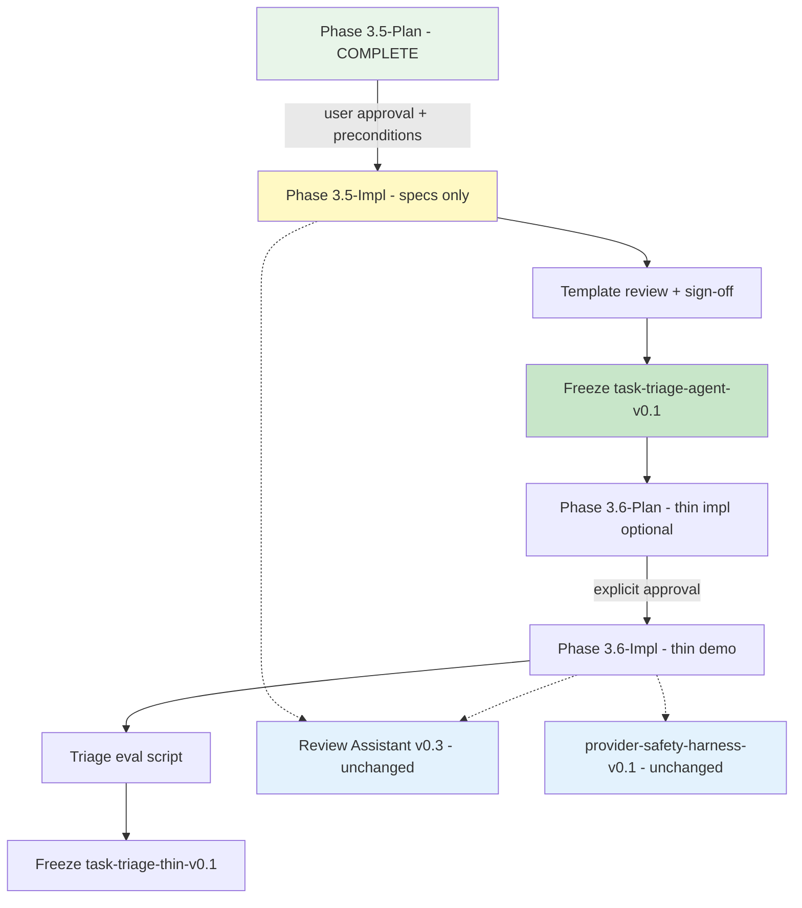

# Future Template Lifecycle — Diagram

**Phase:** 3.5-Plan (planned path — not started)

```mermaid
flowchart TD
    P35P[Phase 3.5-Plan - COMPLETE]
    P35I[Phase 3.5-Impl - specs only]
    REV[Template review + sign-off]
    FRZ[Freeze task-triage-agent-v0.1]
    P36P[Phase 3.6-Plan - thin impl optional]
    P36I[Phase 3.6-Impl - thin demo]
    EVAL[Triage eval script]
    HFZ[Freeze task-triage-thin-v0.1]

    P35P -->|user approval + preconditions| P35I
    P35I --> REV --> FRZ
    FRZ --> P36P
    P36P -->|explicit approval| P36I
    P36I --> EVAL --> HFZ

    RA[Review Assistant v0.3 - unchanged]
    PS[provider-safety-harness-v0.1 - unchanged]

    P35I -.-> RA
    P36I -.-> RA
    P36I -.-> PS

    style P35P fill:#e8f5e9
    style P35I fill:#fff9c4
    style FRZ fill:#c8e6c9
    style RA fill:#e3f2fd
    style PS fill:#e3f2fd
```

**Rule:** Template freeze before thin code. No provider by default at any stage until separate phase.
