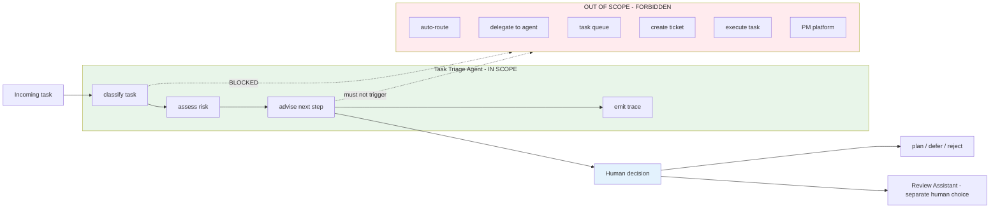

# No Orchestrator Boundary — Diagram

**Phase:** 3.5-Plan

```mermaid
flowchart LR
    subgraph IN[Task Triage Agent - IN SCOPE]
        TRIAGE[classify task]
        RISK[assess risk]
        ADVISE[advise next step]
        TRACE[emit trace]
    end

    subgraph OUT[OUT OF SCOPE - FORBIDDEN]
        ROUTE[auto-route]
        DELEG[delegate to agent]
        QUEUE[task queue]
        TICKET[create ticket]
        EXEC[execute task]
        PM[PM platform]
    end

    TASK[Incoming task] --> TRIAGE
    TRIAGE --> RISK --> ADVISE --> TRACE
    ADVISE --> HUMAN[Human decision]

    TRIAGE -.->|BLOCKED| OUT
    ADVISE -.->|must not trigger| OUT

    HUMAN --> PLAN[plan / defer / reject]
    HUMAN --> REV[Review Assistant - separate human choice]

    style OUT fill:#ffebee
    style IN fill:#e8f5e9
    style HUMAN fill:#e3f2fd
```

Task Triage may **recommend** "needs review" — it may **not** start Review Assistant or any agent automatically.
