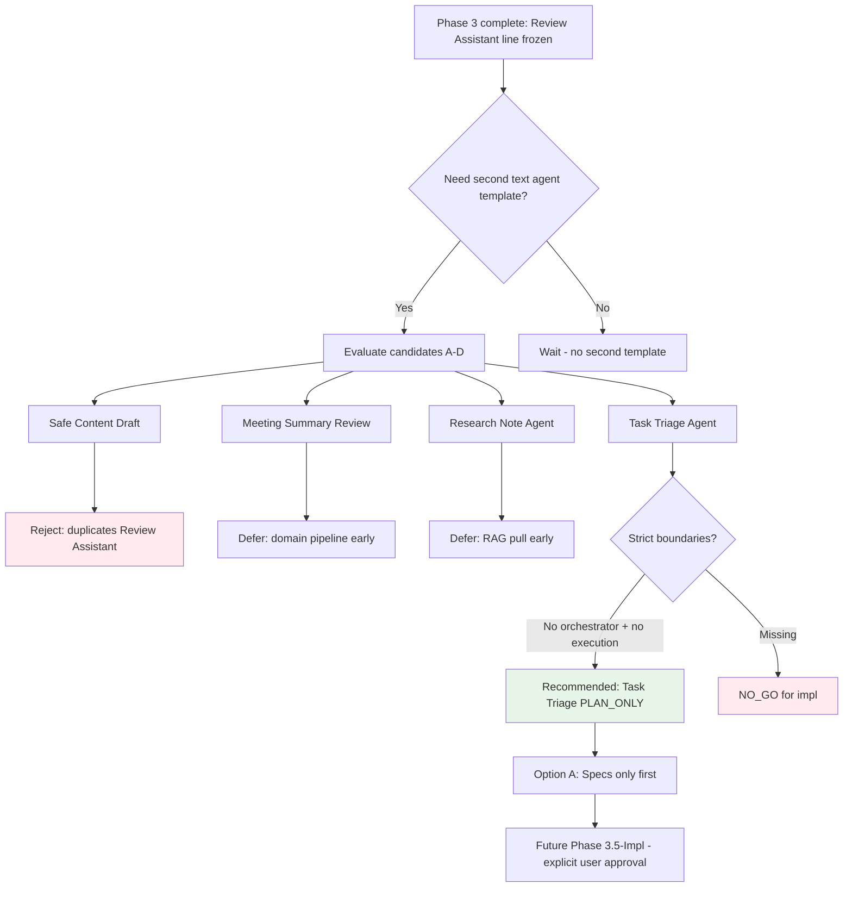

# Second Agent Decision — Diagram

**Phase:** 3.5-Plan

```mermaid
flowchart TD
    START[Phase 3 complete: Review Assistant line frozen]
    START --> Q{Need second text agent template?}
    Q -->|Yes| CAND[Evaluate candidates A-D]
    Q -->|No| WAIT[Wait - no second template]

    CAND --> A[Task Triage Agent]
    CAND --> B[Safe Content Draft]
    CAND --> C[Meeting Summary Review]
    CAND --> D[Research Note Agent]

    B --> REJ_B[Reject: duplicates Review Assistant]
    C --> DEF_C[Defer: domain pipeline early]
    D --> DEF_D[Defer: RAG pull early]

    A --> BOUND{Strict boundaries?}
    BOUND -->|No orchestrator + no execution| REC[Recommended: Task Triage PLAN_ONLY]
    BOUND -->|Missing| NOGO[NO_GO for impl]

    REC --> OPT[Option A: Specs only first]
    OPT --> IMPL[Future Phase 3.5-Impl - explicit user approval]

    style REC fill:#e8f5e9
    style REJ_B fill:#ffebee
    style NOGO fill:#ffebee
```
