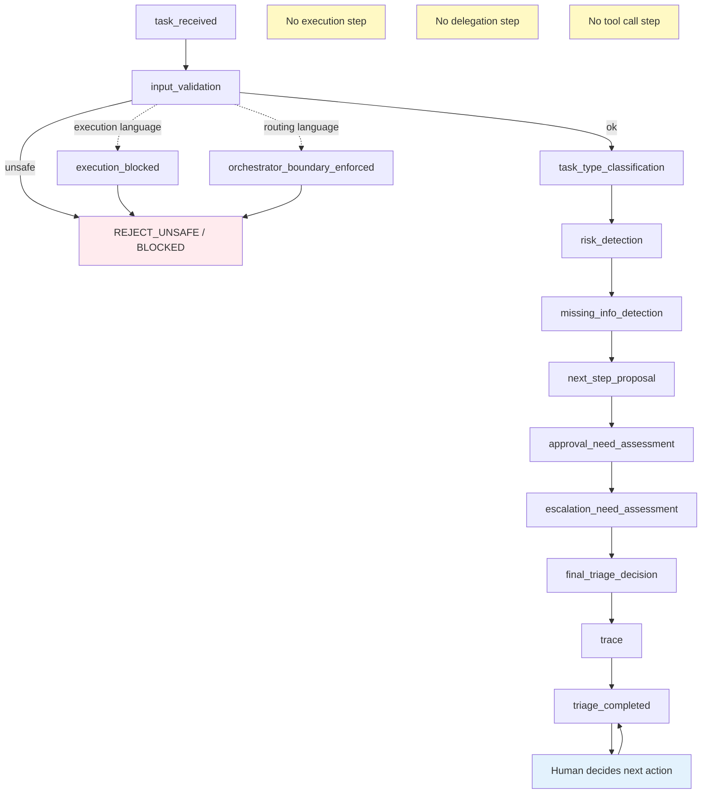

# Task Triage Flow — Diagram

**Phase:** 3.5-Plan

```mermaid
flowchart TD
    T[task_received] --> V[input_validation]
    V -->|unsafe| RU[REJECT_UNSAFE / BLOCKED]
    V -->|ok| TC[task_type_classification]
    TC --> RD[risk_detection]
    RD --> MI[missing_info_detection]
    MI --> NS[next_step_proposal]
    NS --> AR[approval_need_assessment]
    AR --> ER[escalation_need_assessment]
    ER --> FD[final_triage_decision]
    FD --> TR[trace]
    TR --> DONE[triage_completed]

    V -.->|execution language| EB[execution_blocked]
    V -.->|routing language| OB[orchestrator_boundary_enforced]

    EB --> RU
    OB --> RU

    HUMAN[Human decides next action] --> DONE
    DONE --> HUMAN

    note1[No execution step]
    note2[No delegation step]
    note3[No tool call step]

    style RU fill:#ffebee
    style HUMAN fill:#e3f2fd
    style note1 fill:#fff9c4
    style note2 fill:#fff9c4
    style note3 fill:#fff9c4
```

**Explicit absences:** no execution, no delegation, no auto-routing, no tool calls (default).
