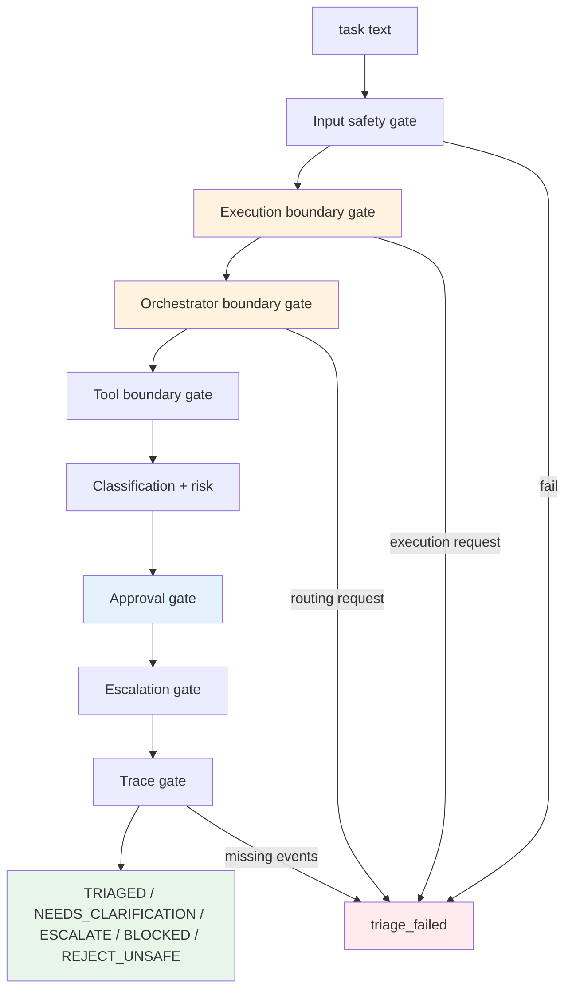

# Triage Safety Gates — Diagram

**Phase:** 3.5-Plan

```mermaid
flowchart TD
    IN[task text] --> G1[Input safety gate]
    G1 --> G2[Execution boundary gate]
    G2 --> G3[Orchestrator boundary gate]
    G3 --> G4[Tool boundary gate]
    G4 --> G5[Classification + risk]
    G5 --> G6[Approval gate]
    G6 --> G7[Escalation gate]
    G7 --> G8[Trace gate]
    G8 --> OUT[TRIAGED / NEEDS_CLARIFICATION / ESCALATE / BLOCKED / REJECT_UNSAFE]

    G1 -->|fail| FC[triage_failed]
    G2 -->|execution request| FC
    G3 -->|routing request| FC
    G8 -->|missing events| FC

    style G2 fill:#fff3e0
    style G3 fill:#fff3e0
    style G6 fill:#e3f2fd
    style FC fill:#ffebee
    style OUT fill:#e8f5e9
```

Fail-closed: unsafe input or policy violation exits before `TRIAGED`.
