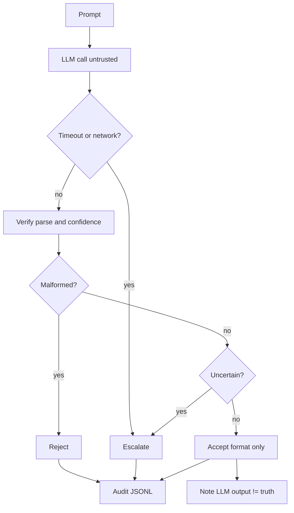

# LLM Verification Flow

```mermaid
flowchart TD
    P[Prompt] --> L[LLM call untrusted]
    L --> T{Timeout or network?}
    T -->|yes| E[Escalate]
    T -->|no| V[Verify parse and confidence]
    V --> M{Malformed?}
    M -->|yes| R[Reject]
    M -->|no| U{Uncertain?}
    U -->|yes| E
    U -->|no| A[Accept format only]
    A --> N[Note LLM output != truth]
    R --> AUD[Audit JSONL]
    E --> AUD
    A --> AUD
```
