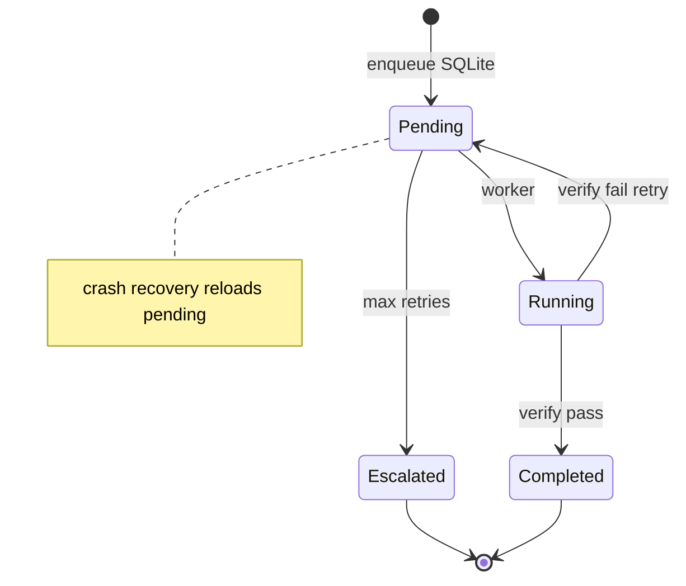

# Local Queue Lifecycle

```mermaid
stateDiagram-v2
    [*] --> Pending: enqueue SQLite
    Pending --> Running: worker
    Running --> Completed: verify pass
    Running --> Pending: verify fail retry
    Pending --> Escalated: max retries
    Escalated --> [*]
    Completed --> [*]
    note right of Pending: crash recovery reloads pending
```
