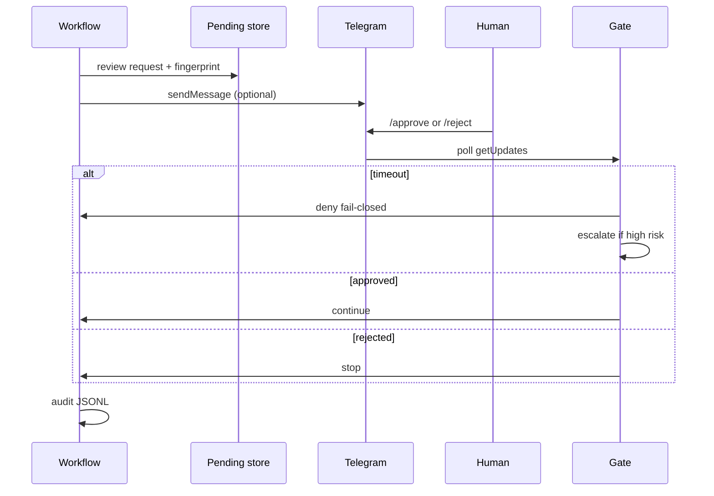

# Telegram Review Flow

```mermaid
sequenceDiagram
    participant W as Workflow
    participant P as Pending store
    participant T as Telegram
    participant H as Human
    participant G as Gate

    W->>P: review request + fingerprint
    W->>T: sendMessage (optional)
    H->>T: /approve or /reject
    T->>G: poll getUpdates
    alt timeout
        G->>W: deny fail-closed
        G->>G: escalate if high risk
    else approved
        G->>W: continue
    else rejected
        G->>W: stop
    end
    W->>W: audit JSONL
```
