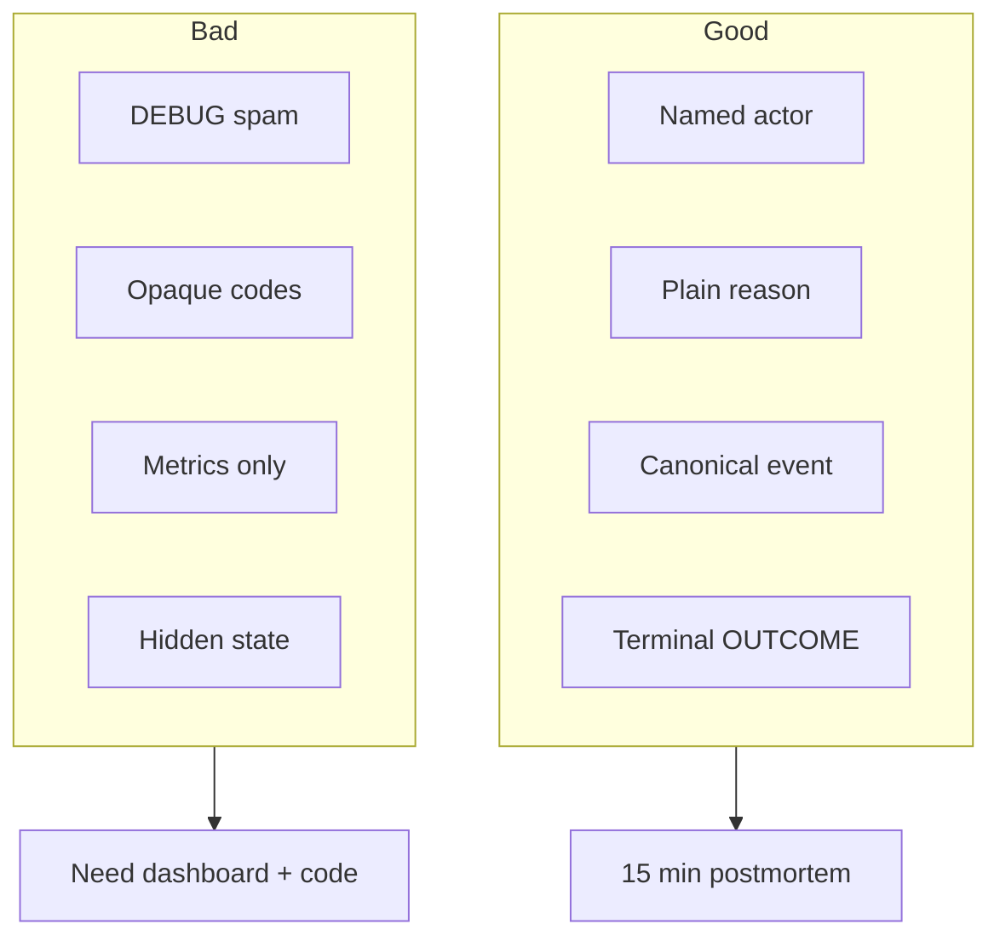

# Human-Readable Logs Diagram

```mermaid
flowchart TD
    subgraph Good
        G1[Named actor]
        G2[Plain reason]
        G3[Canonical event]
        G4[Terminal OUTCOME]
    end
    subgraph Bad
        B1[DEBUG spam]
        B2[Opaque codes]
        B3[Metrics only]
        B4[Hidden state]
    end
    Good --> PM[15 min postmortem]
    Bad --> X[Need dashboard + code]
```
