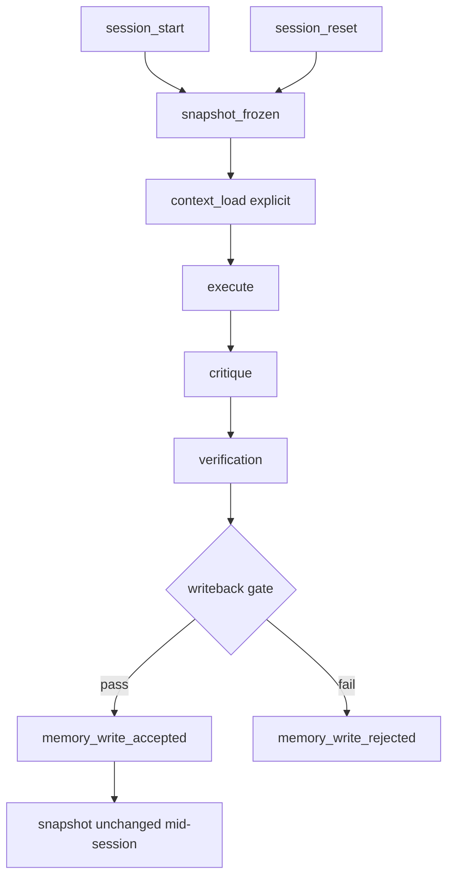

# Memory Lineage Diagram

```mermaid
flowchart TD
    SS[session_start] --> SN[snapshot_frozen]
    SN --> CL[context_load explicit]
    CL --> EX[execute]
    EX --> CR[critique]
    CR --> VR[verification]
    VR --> WR{writeback gate}
    WR -->|pass| WA[memory_write_accepted]
    WR -->|fail| WJ[memory_write_rejected]
    WA --> NOTE[snapshot unchanged mid-session]
    NR[session_reset] --> SN
```
