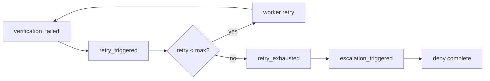

# Retry Escalation Diagram

```mermaid
flowchart LR
    F[verification_failed] --> RT[retry_triggered]
    RT --> RC{retry < max?}
    RC -->|yes| W[worker retry]
    W --> F
    RC -->|no| RX[retry_exhausted]
    RX --> ESC[escalation_triggered]
    ESC --> STOP[deny complete]
```

Storm = loop without RX or ESC node.
