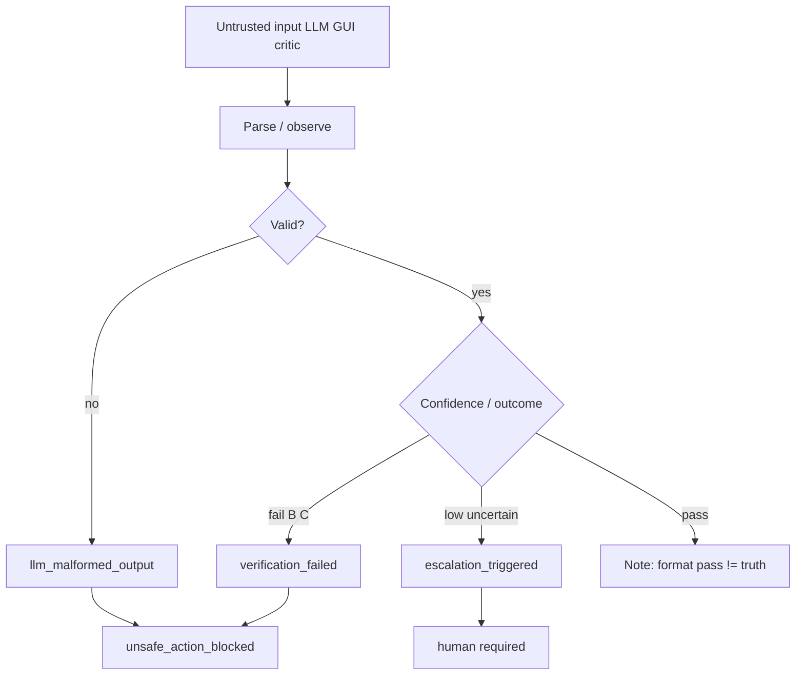

# Verification Failure Diagram

```mermaid
flowchart TD
    IN[Untrusted input LLM GUI critic] --> P[Parse / observe]
    P --> M{Valid?}
    M -->|no| MF[llm_malformed_output]
    M -->|yes| C{Confidence / outcome}
    C -->|low uncertain| U[escalation_triggered]
    C -->|fail B C| VF[verification_failed]
    C -->|pass| NOTE[Note: format pass != truth]
    MF --> REJ[unsafe_action_blocked]
    VF --> REJ
    U --> HITL[human required]
```
