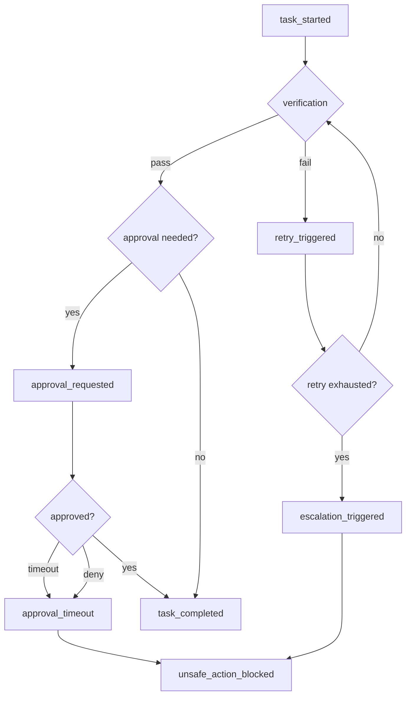

# Workflow Trace Diagram

```mermaid
flowchart TD
    S[task_started] --> V{verification}
    V -->|pass| A{approval needed?}
    V -->|fail| R[retry_triggered]
    R --> E{retry exhausted?}
    E -->|yes| ESC[escalation_triggered]
    E -->|no| V
    A -->|yes| H[approval_requested]
    H --> T{approved?}
    T -->|timeout| DENY[approval_timeout]
    T -->|deny| DENY
    T -->|yes| C[task_completed]
    A -->|no| C
    DENY --> BLOCK[unsafe_action_blocked]
    ESC --> BLOCK
```

Text trace = walk this graph left-to-right.
