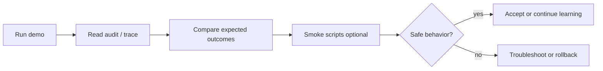

# Evaluation Loop (Operator View)

Operator uses existing Phase 2.5 scripts — does not build new automation.

Detail: `evaluation/diagrams/evaluation-loop.md`

Runbook: [../runbooks/run-evaluation-checks.md](../runbooks/run-evaluation-checks.md)
