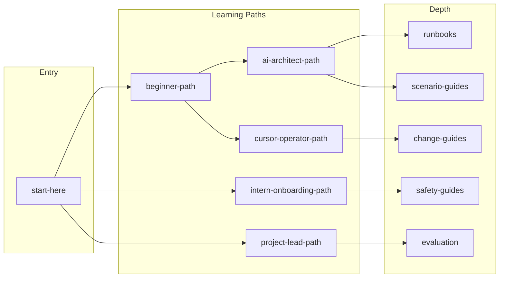

# Learning Paths

```mermaid
flowchart LR
    subgraph entry [Entry]
        SH[start-here]
    end
    subgraph paths [Learning Paths]
        B[beginner-path]
        A[ai-architect-path]
        C[cursor-operator-path]
        I[intern-onboarding-path]
        P[project-lead-path]
    end
    subgraph depth [Depth]
        RB[runbooks]
        SG[scenario-guides]
        SG2[safety-guides]
        EV[evaluation]
        CH[change-guides]
    end
    SH --> B
    SH --> I
    B --> A
    B --> C
    SH --> P
    A --> RB
    A --> SG
    C --> CH
    I --> SG2
    P --> EV
```

Estimated times in each path file under `learning-paths/`.
