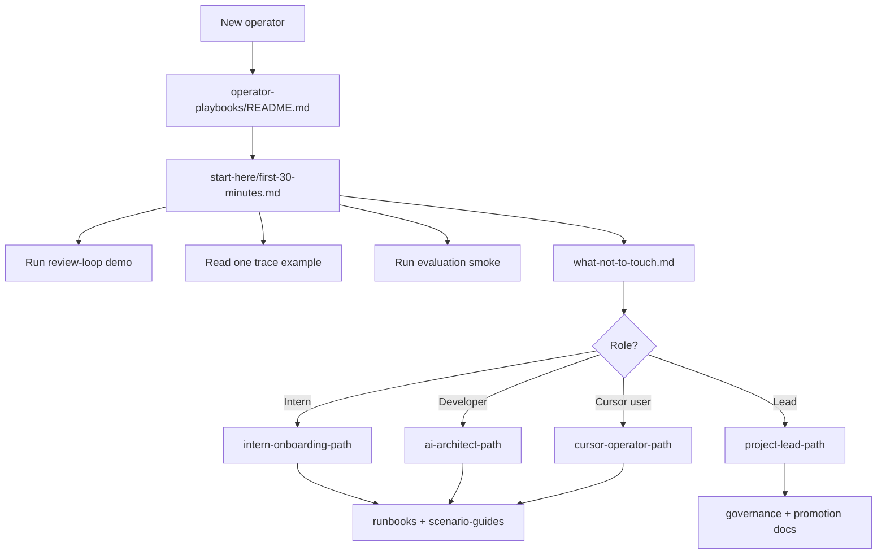

# Operator Entry Flow

```mermaid
flowchart TD
    A[New operator] --> B[operator-playbooks/README.md]
    B --> C[start-here/first-30-minutes.md]
    C --> D[Run review-loop demo]
    C --> E[Read one trace example]
    C --> F[Run evaluation smoke]
    C --> G[what-not-to-touch.md]
    G --> H{Role?}
    H -->|Intern| I[intern-onboarding-path]
    H -->|Developer| J[ai-architect-path]
    H -->|Cursor user| K[cursor-operator-path]
    H -->|Lead| L[project-lead-path]
    I --> M[runbooks + scenario-guides]
    J --> M
    K --> M
    L --> N[governance + promotion docs]
```

Human-operated at every decision point — no automated onboarding system.
