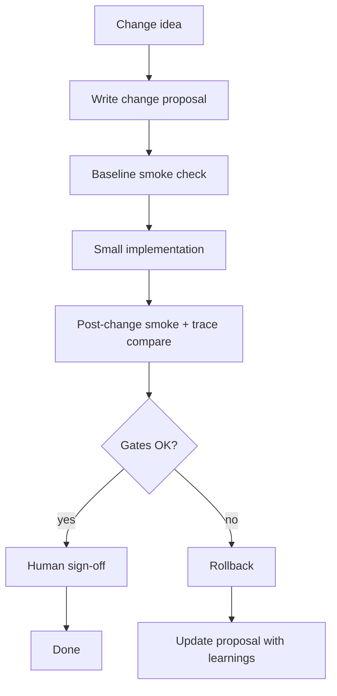

# Safe Change Flow

```mermaid
flowchart TD
    A[Change idea] --> B[Write change proposal]
    B --> C[Baseline smoke check]
    C --> D[Small implementation]
    D --> E[Post-change smoke + trace compare]
    E --> F{Gates OK?}
    F -->|yes| G[Human sign-off]
    F -->|no| H[Rollback]
    H --> I[Update proposal with learnings]
    G --> J[Done]
```

Links: `change-guides/`, `runbooks/perform-safe-change.md`, `evolution/`
