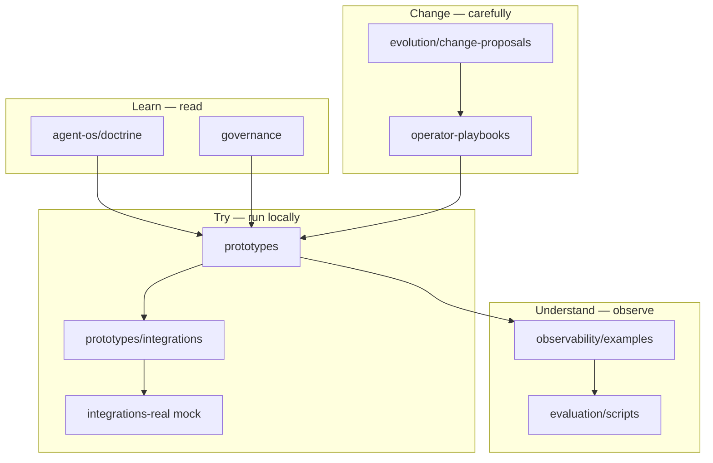

# System Map for Beginners

**Start arrow:** `operator-playbooks/start-here/start-here.md`

**Do not start in:** `Books/` (source corpus), `experiments/` (research)

---

## One-line layer summary

| Folder | Beginner description |
|--------|---------------------|
| agent-os | What we believe about safe agents |
| prototypes | Tiny demos proving those beliefs |
| observability | Example logs of good/bad behavior |
| evaluation | Check demos still behave |
| evolution | How to change without breaking gates |
| operator-playbooks | How humans navigate all of this |
