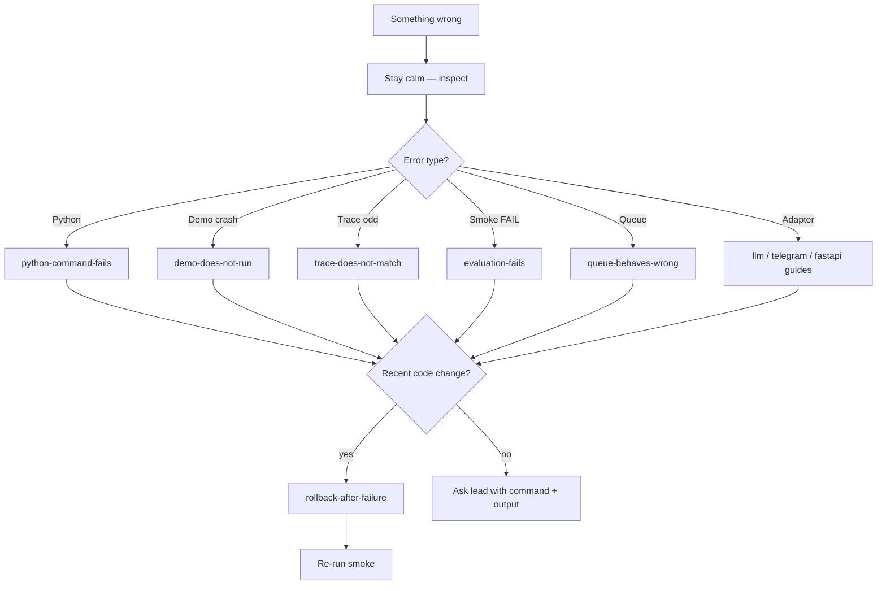

# Troubleshooting Flow

```mermaid
flowchart TD
    A[Something wrong] --> B[Stay calm — inspect]
    B --> C{Error type?}
    C -->|Python| D[python-command-fails]
    C -->|Demo crash| E[demo-does-not-run]
    C -->|Trace odd| F[trace-does-not-match]
    C -->|Smoke FAIL| G[evaluation-fails]
    C -->|Queue| H[queue-behaves-wrong]
    C -->|Adapter| I[llm / telegram / fastapi guides]
    D --> J{Recent code change?}
    E --> J
    F --> J
    G --> J
    H --> J
    I --> J
    J -->|yes| K[rollback-after-failure]
    J -->|no| L[Ask lead with command + output]
    K --> M[Re-run smoke]
```

No blind patching: `governance/no-blind-patching.md`
