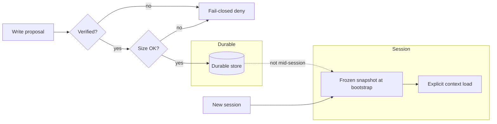

# Bounded Memory Diagram

```mermaid
flowchart LR
    subgraph Session
        SN[Frozen snapshot at bootstrap]
        CTX[Explicit context load]
        SN --> CTX
    end

    subgraph Durable
        DS[(Durable store)]
    end

    W[Write proposal] --> V{Verified?}
    V -->|no| DENY[Fail-closed deny]
    V -->|yes| S{Size OK?}
    S -->|no| DENY
    S -->|yes| DS
    DS -.->|not mid-session| SN
    RESET[New session] --> SN
```
