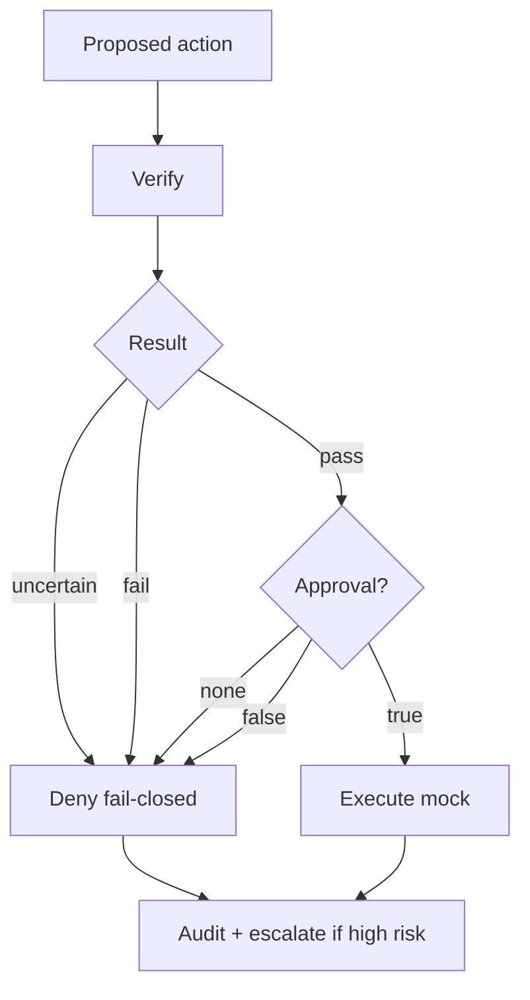

# Fail-Closed External Action Diagram

```mermaid
flowchart TD
    A[Proposed action] --> V[Verify]
    V --> U{Result}
    U -->|uncertain| DENY[Deny fail-closed]
    U -->|fail| DENY
    U -->|pass| G{Approval?}
    G -->|none| DENY
    G -->|false| DENY
    G -->|true| E[Execute mock]
    DENY --> AUD[Audit + escalate if high risk]
    E --> AUD
```
