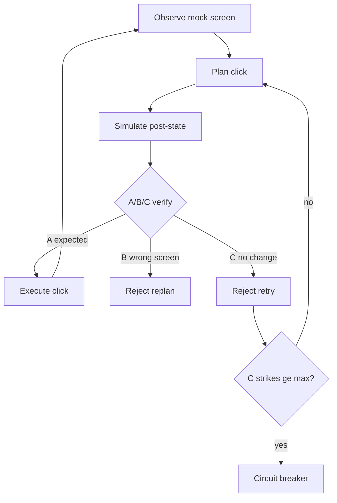

# GUI Verification Diagram

```mermaid
flowchart TD
    O[Observe mock screen] --> P[Plan click]
    P --> SIM[Simulate post-state]
    SIM --> V{A/B/C verify}
    V -->|A expected| X[Execute click]
    V -->|B wrong screen| R[Reject replan]
    V -->|C no change| R2[Reject retry]
    R2 --> CB{C strikes ge max?}
    CB -->|yes| ESC[Circuit breaker]
    CB -->|no| P
    X --> O
```
