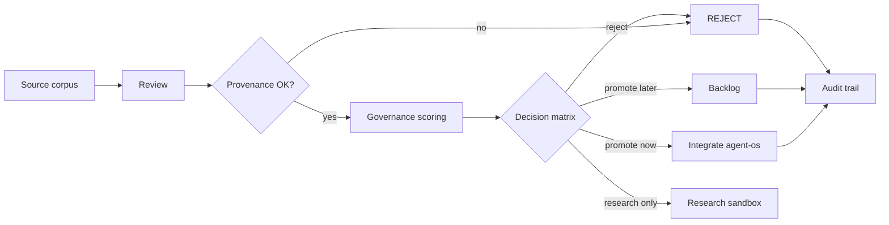

# Promotion Pipeline Diagram

```mermaid
flowchart LR
    S[Source corpus] --> R[Review]
    R --> P{Provenance OK?}
    P -->|no| REJ[REJECT]
    P -->|yes| G[Governance scoring]
    G --> D{Decision matrix}
    D -->|promote now| I[Integrate agent-os]
    D -->|promote later| BL[Backlog]
    D -->|research only| RS[Research sandbox]
    D -->|reject| REJ
    I --> AUD[Audit trail]
    BL --> AUD
    REJ --> AUD
```
