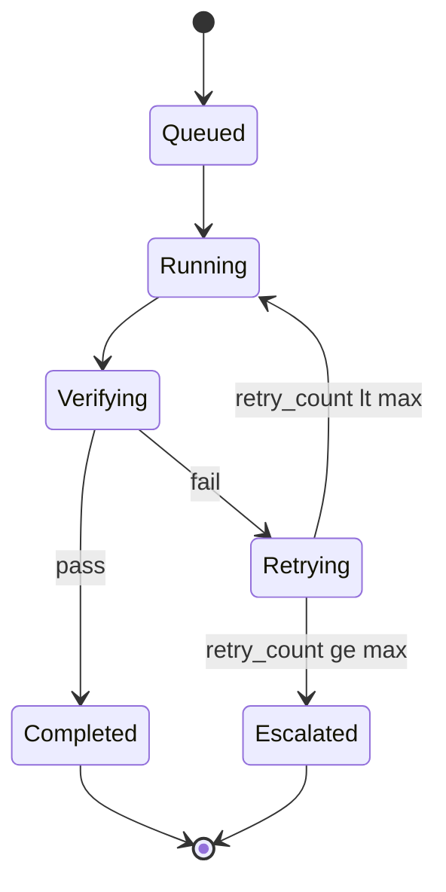

# Queue Lifecycle Diagram

```mermaid
stateDiagram-v2
    [*] --> Queued
    Queued --> Running
    Running --> Verifying
    Verifying --> Completed : pass
    Verifying --> Retrying : fail
    Retrying --> Running : retry_count lt max
    Retrying --> Escalated : retry_count ge max
    Escalated --> [*]
    Completed --> [*]
```
