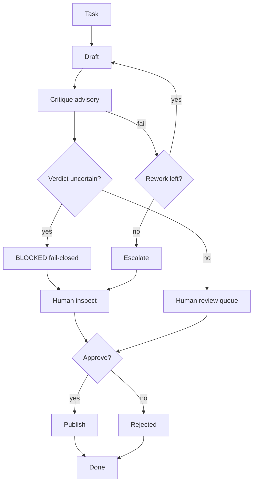

# Review Loop Diagram

```mermaid
flowchart TD
    T[Task] --> D[Draft]
    D --> C[Critique advisory]
    C --> U{Verdict uncertain?}
    U -->|yes| B[BLOCKED fail-closed]
    B --> H[Human inspect]
    U -->|no| H2[Human review queue]
    H --> HD{Approve?}
    H2 --> HD
    HD -->|yes| P[Publish]
    HD -->|no| R[Rejected]
    C -->|fail| RW{Rework left?}
    RW -->|yes| D
    RW -->|no| E[Escalate]
    E --> H
    P --> X[Done]
    R --> X
```
