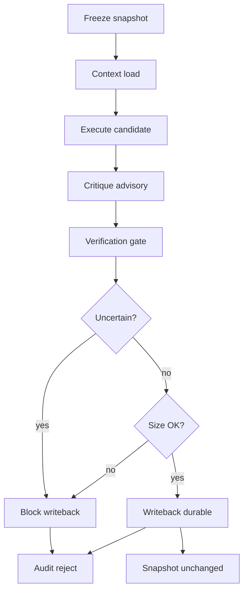

# Bounded Memory Review

```mermaid
flowchart TD
    SN[Freeze snapshot] --> L[Context load]
    L --> E[Execute candidate]
    E --> C[Critique advisory]
    C --> V[Verification gate]
    V --> U{Uncertain?}
    U -->|yes| BL[Block writeback]
    U -->|no| S{Size OK?}
    S -->|no| BL
    S -->|yes| W[Writeback durable]
    W --> SN2[Snapshot unchanged]
    BL --> AUD[Audit reject]
    W --> AUD
```
