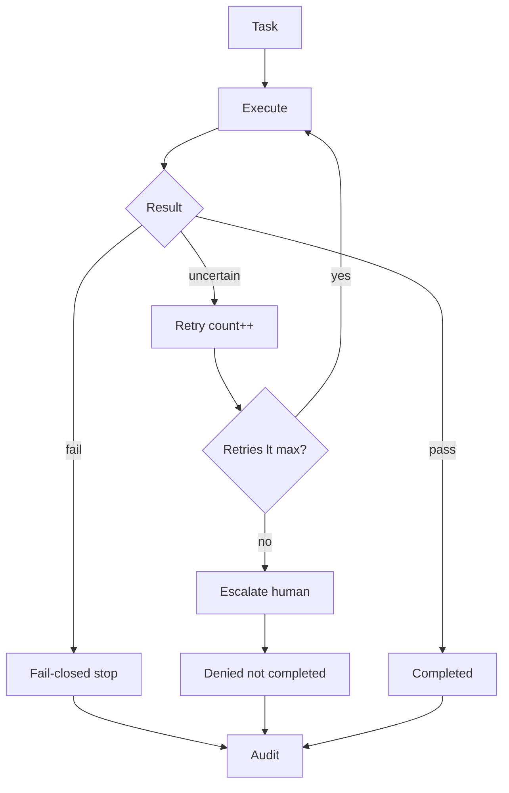

# Escalation Workflow

```mermaid
flowchart TD
    T[Task] --> E[Execute]
    E --> C{Result}
    C -->|pass| DONE[Completed]
    C -->|uncertain| R[Retry count++]
    R --> RT{Retries lt max?}
    RT -->|yes| E
    RT -->|no| ESC[Escalate human]
    C -->|fail| STOP[Fail-closed stop]
    ESC --> DENY[Denied not completed]
    STOP --> AUD[Audit]
    DENY --> AUD
    DONE --> AUD
```
