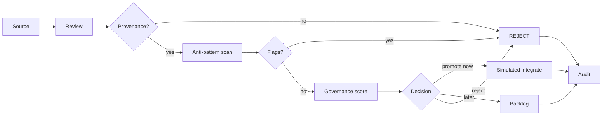

# Governed Promotion

```mermaid
flowchart LR
    S[Source] --> R[Review]
    R --> P{Provenance?}
    P -->|no| REJ[REJECT]
    P -->|yes| AP[Anti-pattern scan]
    AP --> F{Flags?}
    F -->|yes| REJ
    F -->|no| G[Governance score]
    G --> D{Decision}
    D -->|promote now| I[Simulated integrate]
    D -->|later| BL[Backlog]
    D -->|reject| REJ
    I --> AUD[Audit]
    BL --> AUD
    REJ --> AUD
```
